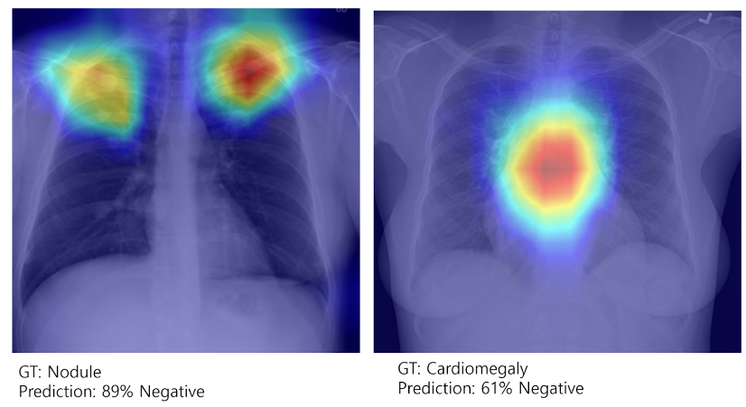

<!-----

You have some errors, warnings, or alerts. If you are using reckless mode, turn it off to see inline alerts.
* ERRORs: 0
* WARNINGs: 0
* ALERTS: 16

Conversion time: 5.673 seconds.

Using this Markdown file:

1. Paste this output into your source file.
2. See the notes and action items below regarding this conversion run.
3. Check the rendered output (headings, lists, code blocks, tables) for proper
   formatting and use a linkchecker before you publish this page.

Conversion notes:

* Docs to Markdown version 1.0β35
* Mon Dec 04 2023 23:08:44 GMT-0800 (PST)
* Source doc: CXR project
* This document has images: check for >>>>>  gd2md-html alert:  inline image link in generated source and store images to your server. NOTE: Images in exported zip file from Google Docs may not appear in  the same order as they do in your doc. Please check the images!

----->

<!-- 
>>>>>  gd2md-html alert:  ERRORs: 0; WARNINGs: 0; ALERTS: 16.

<ul style="color: red; font-weight: bold"><li>See top comment block for details on ERRORs and WARNINGs. <li>In the converted Markdown or HTML, search for inline alerts that start with >>>>>  gd2md-html alert:  for specific instances that need correction.</ul>

Links to alert messages:
<a href="#gdcalert1">alert1</a>
<a href="#gdcalert2">alert2</a>
<a href="#gdcalert3">alert3</a>
<a href="#gdcalert4">alert4</a>
<a href="#gdcalert5">alert5</a>
<a href="#gdcalert6">alert6</a>
<a href="#gdcalert7">alert7</a>
<a href="#gdcalert8">alert8</a>
<a href="#gdcalert9">alert9</a>
<a href="#gdcalert10">alert10</a>
<a href="#gdcalert11">alert11</a>
<a href="#gdcalert12">alert12</a>
<a href="#gdcalert13">alert13</a>
<a href="#gdcalert14">alert14</a>
<a href="#gdcalert15">alert15</a>
<a href="#gdcalert16">alert16</a>

>>>>> PLEASE check and correct alert issues and delete this message and the inline alerts.

 -->

## Bayesian Statistics in Deep Learning

Traditional statistics

* Parameters are considered to be fixed but unknown
* Predictions are made based off observing known data

Bayesian statistics

* Both parameters and data are considered random and unknown
* Predictions are updated based on data

Traditional models: uses fixed parameters for estimation

* Makes** deterministic predictions **for a given situation
* **Can not incorporate inherent uncertainty** in parameter values or data

Bayesian models: uses probability distributions as parameters for estimation

* Outputs a **range of possible predictions **with their confidence scores
* **Incorporates inherent uncertainty** in real world situations (ex. noisy data)

Bayesian deep learning models excel in domains with high-risk, mainly medical imaging, owing to their ability to account for uncertainty. However, Bayesian inferences are computationally demanding, requiring integration over high-dimensional parameter spaces.

To ease the computational demand, Monte Carlo Dropout is introduced as a technique that implicitly performs Bayesian inference, thereby representing uncertainty in predictions.

In “[Dropout as a Bayesian Approximation: Representing Model Uncertainty in Deep Learning](https://arxiv.org/abs/1506.02142)”, MC Dropout is viewed as a method to average predictions over an ensemble of networks, approximating the integral of the posterior.

## Chest X-Rays (CXRs) for Medical Checkups

Chest X-Rays (CXRs) are commonly used as a diagnostic tool for a variety of heart and lung conditions. They are often used during medical checkups to diagnose conditions such as pneumonia, heart failure, and other respiratory or cardiovascular issues. Further, they are used to identify potential abnormalities for early detection of conditions such as lung cancer. 

However, the manual inspection of X-rays by radiologists, often taking several minutes per image, can be time-consuming, especially during medical checkups. To address this, various innovative methods have been proposed to aid in the screening of abnormal CXRs. An essential quality for an ideal CXR model is its ability to minimize false diagnoses, specifically focusing on reducing false negatives. This ensures that individuals requiring medical attention are not incorrectly advised to go home.

The objective of this experiment is to develop a CXR screening model tailored for medical checkups, emphasizing the reliable screening of negative X-ray scans. The model excludes X-ray scans with support devices and is designed to assess images against 14 common anomalies. The priority is to minimize false negatives, prioritizing specificity over overall performance.

## Quantifying Uncertainty in CXR Anomaly Detection

The following experiments aimed to assess uncertainty in Chest-X-Ray anomaly detection by implementing Bayesian inferences across various State-Of-The-Art (SOTA) models and testing them across diverse Chest-X-Ray domains. ResNet-18 was selected based on successful outcomes demonstrated in various papers. DenseNet-121 was chosen due to comparable alternatives offered by different companies. ViT was selected for its innovative approach to anomaly detection.

"Uncertainty scores" are calculated based on the distribution of confidence scores. The goal of these experiments was to reduce false negatives as much as possible. The first few experiments verify that uncertainty scores are capable of separating true and false predictions. Later experiments compare results against traditional models. 

The findings suggest that Bayesian models excel in capturing uncertainty compared to traditional SOTA models. The best **bayesian model had a specificity of 0.93 and an F1 score of 0.94** compared to the best **vanilla model with a specificity of 0.895 and F1 score of 0.92**.

However, similar to traditional models, Bayesian models struggled to address medical accuracy in predictions and encountered challenges related to domain adaptability. In conclusion, to address the issue of domain variance, a continuous model is proposed, aiming to facilitate model adaptation to different X-Ray machines utilized in various hospital settings.

## Datasets Used

Frontal PA Chest-X-Rays are used in the following experiments. In all experiments, positive and negative images are split in a 1:1 ratio to avoid bias. X-Ray scans with support devices are removed.

[CheXpert](https://stanfordmlgroup.github.io/competitions/chexpert/)

* Positive: 16974
* Negative: 174053
* Total used: 33948

[MIMIC](https://physionet.org/content/mimiciii/1.4/)

* Positive: 46285
* Negative: 49864
* Total used: 92570

[ChestX-ray14](https://paperswithcode.com/dataset/chestx-ray14)

* Positive: 5740
* Negative: 5453
* Total used: 11193

CheXpert and MIMIC are datasets collected from multiple hospitals and clinics. They contain an unknown amount of noisy data—such as X-Ray scans zoomed into Regions of Interest (ROIs), or X-Ray scans with incorrect DICOM tags (ex. lateral images marked as frontal).

ChestX-ray14 is a dataset collected from the NIH Clinical Center. Further, the subset of ChestX-ray14 used in training, validation, and testing was verified by radiologists for correctness.

## ResNet-18 Experiments

Transfer learning is used with a pretrained ResNet-18 model, which is then trained on the CheXpert database to output binary predictions for Chest-X-Rays. Variance in confidence scores and estimates are used to calculate uncertainty. Hence, when interpreting graphs of uncertainty scores, lower numbers should be seen as more “certain” whereas higher numbers should be seen as “uncertain”.

The first model “Bayesian with MC Dropout” is a ResNet-18 model that uses MC Dropout on all linear transformation layers (except for the last one needed for dimension reduction), and is trained with a dropout probability of 0.5. This model can be found at: [resnet18/bayesian_resnet_2.py](resnet18/bayesian_resnet_2.py)

The second model “Probabilistic” is a Variational ResNet-18 model that aims to find a probabilistic function to map the relation between CXRs and predictions. This method is 

presented in [this paper](https://arxiv.org/pdf/1908.00792v1.pdf). The model can be found at

[resnet18/probabilistic_resnet.py](resnet18/probabilistic_resnet.py)

When trained and validated on CheXpert, the Bayesian model shows a clear separation of true and false guesses. The model is more certain about true guesses, whereas false guesses had a higher uncertainty score. The probabilistic model did not perform as well, making too many false negative predictions.

<!-- 
>>>>>  gd2md-html alert: inline image link here (to images/image1.png). Store image on your image server and adjust path/filename/extension if necessary.  (<a href="#">Back to top</a>)(<a href="#gdcalert2">Next alert</a>) >>>>> 
 -->

<!-- 
>>>>>  gd2md-html alert: inline image link here (to images/image2.png). Store image on your image server and adjust path/filename/extension if necessary.  (<a href="#">Back to top</a>)(<a href="#gdcalert3">Next alert</a>) >>>>> 
 -->

When validated on MIMIC, both models performed under expectations, showing the clear domain adaptability issue.

## DenseNet-121 Experiments

Transfer learning is used with DenseNet-121 which is pretrained on ImageNet. CheXpert and MIMIC are used for training and validation in this experiment. To identify the effects of preprocessing on uncertainty, various preprocessing techniques are experimented with. The model used in this experiment was inspired after [this paper](https://ieeexplore.ieee.org/document/). MC Dropout is implemented in each “Dense Block” to preserve the spatial structure. 

<!-- 
>>>>>  gd2md-html alert: inline image link here (to images/image3.png). Store image on your image server and adjust path/filename/extension if necessary.  (<a href="#">Back to top</a>)(<a href="#gdcalert4">Next alert</a>) >>>>> 
 -->

Mutual information of the mean of predictions and weighted predictions are used to calculate uncertainty scores. This model can be found at

[densenet121/densenet.py](densenet121/densenet.py)

First, DenseNet-121 was trained on MIMIC, with a variety of preprocessing techniques and a drop rate of 0.5.

Preprocessing techniques used

* Resize
* Random rotation
* HIstogram equalization
* CLAHE
* Partial masking

This graph represents results from the preprocessing techniques with the highest validation accuracy, which used a 512x512 image with CLAHE and random rotation of 15 degrees. This is the distribution of uncertainty scores from training and validating on MIMIC. With an 80% validation accuracy, true negatives can be seen distributed relatively evenly compared to false predictions, which the model was less certain about. 

This can also be seen in the following confusion matrix when thresholding is applied.

<!-- 
>>>>>  gd2md-html alert: inline image link here (to images/image4.png). Store image on your image server and adjust path/filename/extension if necessary.  (<a href="#">Back to top</a>)(<a href="#gdcalert5">Next alert</a>) >>>>> 
 -->

However, when the same model was tested with CheXpert, the specificity drops drastically.

<!-- 
>>>>>  gd2md-html alert: inline image link here (to images/image5.png). Store image on your image server and adjust path/filename/extension if necessary.  (<a href="#">Back to top</a>)(<a href="#gdcalert6">Next alert</a>) >>>>> 
 -->

With a validation accuracy of 60%, true negatives are very low.

The same model was then trained with a 1:1 mix of CheXpert and MIMIC

Training and testing with a lower drop rate (0.2 instead of 0.5) significantly improved the validation accuracy of the model, achieving an accuracy of 76%. However, the model still suffered with a high number of false negatives. Although this could be mitigated by uncertainty thresholding, it is still above the 1% mark, hence, is not a viable solution.

<!-- 
>>>>>  gd2md-html alert: inline image link here (to images/image6.png). Store image on your image server and adjust path/filename/extension if necessary.  (<a href="#">Back to top</a>)(<a href="#gdcalert7">Next alert</a>) >>>>> 
 -->

## Vision Transformer Experiments

Transfer learning is used with ViT-Base-patch-16-224, pretrained on ImageNet-21k. ViT-B was chosen, following the successful results from [this paper](https://openaccess.thecvf.com/content/ACCV2022W/CVMC/papers/Wei_Ensemble_Model_of_Visual_Transformer_and_CNN_Helps_BA_Diagnosis_ACCVW_2022_paper.pdf). MC Dropout is implemented in the feed-forward components of each Encoding Block. 

Like with previous experiments, mutual information of the mean of predictions and weighted predictions are used to calculate uncertainty scores. This model can be found at

[vit/bayesian_vit.py](vit/bayesian_vit.py)

The settings of random rotation, CLAHE application, and a dropout rate of 0.2 were chosen based on their success in previous experiments. ViT-B underwent training on the MIMIC dataset for 7 days, utilizing two NVIDIA TITAN RTX GPUs. Despite the extensive parameter space, the training duration was constrained to 20 epochs.

The findings suggest that the pretrained weights exhibit superior performance compared to the fine-tuned weights. This outcome can be attributed to the relatively smaller size of MIMIC in comparison to ImageNet21k and the limited number of epochs during training.

<!-- 
>>>>>  gd2md-html alert: inline image link here (to images/image7.png). Store image on your image server and adjust path/filename/extension if necessary.  (<a href="#">Back to top</a>)(<a href="#gdcalert8">Next alert</a>) >>>>> 
 -->

Although the ViT-B model underperformed other models at identifying true negatives, it had lower false negatives.

<!-- 
>>>>>  gd2md-html alert: inline image link here (to images/image8.png). Store image on your image server and adjust path/filename/extension if necessary.  (<a href="#">Back to top</a>)(<a href="#gdcalert9">Next alert</a>) >>>>> 
 -->

[Other experiments](https://openaccess.thecvf.com/content/ACCV2022W/CVMC/papers/Wei_Ensemble_Model_of_Visual_Transformer_and_CNN_Helps_BA_Diagnosis_ACCVW_2022_paper.pdf) suggest that ensembles of Vision Transformers can outperform traditional SOTA models with adequate training:

<!-- 
>>>>>  gd2md-html alert: inline image link here (to images/image9.png). Store image on your image server and adjust path/filename/extension if necessary.  (<a href="#">Back to top</a>)(<a href="#gdcalert10">Next alert</a>) >>>>> 
 -->

Nonetheless, these marginal improvements come with a demand for more computational power. Given that assessing uncertainty through MC Dropout involves additional training and multiple evaluation iterations compared to conventional models, there is a limitation in utilizing vision transformers for uncertainty quantification.

## Experiments with Other Domains

While previous experiments indicate that SOTA models can identify anomalies in CXRs with an accuracy of approximately 80%, [alternative research papers](https://www.nature.com/articles/s41746-020-0273-z) assert that their models achieved accuracies as high as 95% in performing this task.

To further investigate this, a selection of scans from CheXpert and MIMIC was randomly chosen and examined. Within this random sample, approximately 5-10% of scans were deemed inadequate due to various issues, including some being zoomed into specific regions of interest (ROIs) and others having incorrect labels. Notably, there were instances of lateral scans incorrectly labeled as frontal scans that were included in the training and validation sets. 

As the issues may have occurred when converting DICOM scans to JPEG for training, the original DICOM scans were examined as well. However,  the erroneous labels identified in the JPEG dataset were found to be consistent with those present in the DICOM dataset. 

Additionally, given that CheXpert and MIMIC are datasets sourced from various hospitals with diverse X-ray wavelengths, the scans exhibited significant visual distinctions despite undergoing identical preprocessing steps. Although CLAHE was used as an attempt to overcome this issue, the differences were still visible.

<!-- 
>>>>>  gd2md-html alert: inline image link here (to images/image10.png). Store image on your image server and adjust path/filename/extension if necessary.  (<a href="#">Back to top</a>)(<a href="#gdcalert11">Next alert</a>) >>>>> 
 -->

Sample image from CheXpert—the bottom part of the lungs are not visible in this image

<!-- 
>>>>>  gd2md-html alert: inline image link here (to images/image11.png). Store image on your image server and adjust path/filename/extension if necessary.  (<a href="#">Back to top</a>)(<a href="#gdcalert12">Next alert</a>) >>>>> 
 -->

Sample images from MIMIC—the opacity of the organs are different in each scan

To confirm that low accuracy is caused by the erroneous data, ChestX-ray 14—a dataset validated by radiologists—was used to train and test a pre-trained DenseNet121 model as presented in “[Automated abnormality classification of chest radiographs using deep convolutional neural networks](https://www.nature.com/articles/s41746-020-0273-z)”. The same Bayesian DenseNet-121 model from the previous experiment was used.

Similar to prior experiments, uncertainty scores are computed using mutual information, considering both the mean of predictions and weighted predictions. Furthermore, the analysis involves assessing the standard deviation of predictions for each scan. This approach is grounded in the intuition that the model is expected to provide consistent predictions for scans it confidently identifies.

The Bayesian DenseNet model outperformed the Vanilla DenseNet model presented in the paper, reducing false negatives by 15.6%. The bayesian model had a specificity of 0.93 and an F1 score of 0.94, while the vanilla model had a specificity of 0.895 and F1 score of 0.92.

<!-- 
>>>>>  gd2md-html alert: inline image link here (to images/image12.png). Store image on your image server and adjust path/filename/extension if necessary.  (<a href="#">Back to top</a>)(<a href="#gdcalert13">Next alert</a>) >>>>> 
 -->

Mutual information-based uncertainty scores were predominantly elevated for both true and false negatives, evident in the left-skewed distribution. Uncertainty scores computed through standard deviation indicated that the model exhibited greater consistency with true negatives compared to false negatives.

<!-- 
>>>>>  gd2md-html alert: inline image link here (to images/image13.png). Store image on your image server and adjust path/filename/extension if necessary.  (<a href="#">Back to top</a>)(<a href="#gdcalert14">Next alert</a>) >>>>> 
 -->

In summary, incorporating weights in both mutual information and standard deviation proves to be an effective approach for filtering out false negatives.

Despite the success with ChestX-ray14, both Bayesian and Vanilla model weights did not perform well when tested with PadChest and MIMIC—contrary to what the findings in the NIH paper suggested.

<!-- 
>>>>>  gd2md-html alert: inline image link here (to images/image14.png). Store image on your image server and adjust path/filename/extension if necessary.  (<a href="#">Back to top</a>)(<a href="#gdcalert15">Next alert</a>) >>>>> 
 -->

Multiple studies have emphasized the challenges and difficulties associated with handling diverse domains and wavelengths of X-rays. Consequently, a continuous model is suggested, aiming to enhance models continually by incorporating X-ray scans from individual clinics.

Finally, to validate the medical accuracy of DenseNet, Grad-CAM was used to visualize the model’s predictions.

True Positive:

<!-- 
>>>>>  gd2md-html alert: inline image link here (to images/image15.png). Store image on your image server and adjust path/filename/extension if necessary.  (<a href="#">Back to top</a>)(<a href="#gdcalert16">Next alert</a>) >>>>> 
 -->

False Negative:

<!-- 
>>>>>  gd2md-html alert: inline image link here (to images/image16.png). Store image on your image server and adjust path/filename/extension if necessary.  (<a href="#">Back to top</a>)(<a href="#gdcalert17">Next alert</a>) >>>>> 
 -->

While the model demonstrates proficiency in correctly identifying Regions of Interest (ROIs), it has a tendency to generate medically inaccurate predictions.
